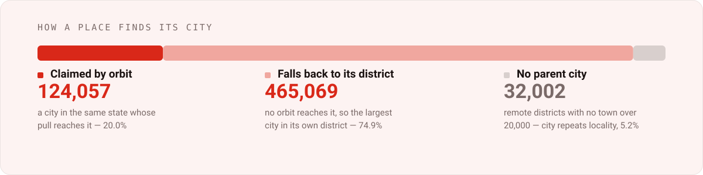
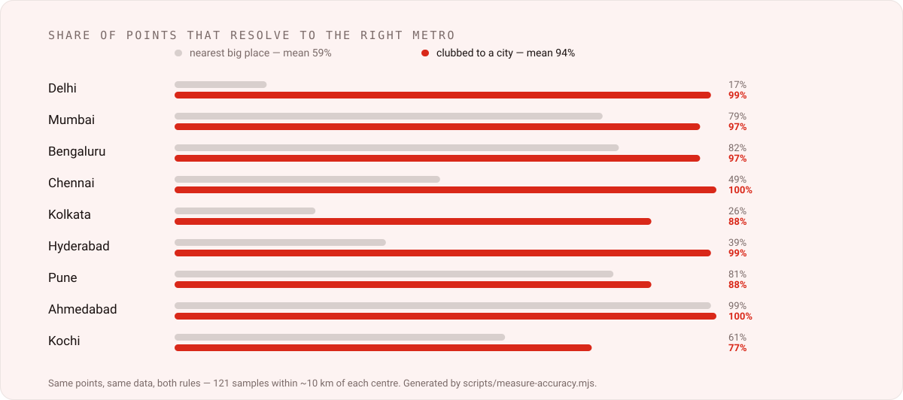

<div align="center">

<picture>
  <source media="(prefers-color-scheme: dark)" srcset="assets/mascot-dark.svg">
  
</picture>

# Nishaan

**Coordinates in, the city you actually belong to out.**<br>
No Google, no API keys, no external calls, no dependencies.

[](../../actions/workflows/test.yml)
[](../../releases)
[](LICENSE)
[](package.json)
[](https://www.geonames.org/)

<picture>
  <source media="(prefers-color-scheme: dark)" srcset="assets/hero-animated-dark.svg">
  
</picture>

**[Try it live →](https://dibakar01.github.io/reverse-geocoding/demo/)**

</div>

## Run it

```sh
npm run build-data   # once: downloads ~21 MB from GeoNames, builds data/
npm start            # :3000
npm test             # 30 assertions
```

```sh
curl 'localhost:3000/reverse?lat=22.5800&lon=88.4200'
```

```json
{
  "locality": "Salt Lake City",
  "district": "North 24 Parganas",
  "city": "Kolkata",
  "state": "West Bengal",
  "country": "India",
  "displayName": "Salt Lake City, Kolkata, West Bengal, India"
}
```

Salt Lake is administratively in **North 24 Parganas**, not Kolkata district. It
is still Kolkata. That gap between the administrative answer and the true one is
the whole problem this solves.

## Which city do I belong to?

Not "what is nearest". Nearest gives you *Dam Dam* for Salt Lake and *Dharavi*
for Bandra. Belonging is a question about **orbit** — whose pull are you in?

```
score = population / distance²        ×1.6 if the city is in your own district
```

<picture>
  <source media="(prefers-color-scheme: dark)" srcset="assets/rules-dark.svg">
  
</picture>

### How a place finds its city

<picture>
  <source media="(prefers-color-scheme: dark)" srcset="assets/flow-dark.svg">
  
</picture>

Computed **once, at build time**, and stored as a row index. So the mapping is
fixed and inspectable, the same locality always resolves to the same city, and
the runtime lookup is a plain nearest-neighbour scan with no scoring in it.

## Accuracy

An independent audit of 37 well-known localities found the first version unfit to
ship — Delhi resolved correctly for under half its own area. Both rules measured
over the same points and the same data, 121 samples within ~10 km of each centre:

<picture>
  <source media="(prefers-color-scheme: dark)" srcset="assets/accuracy-dark.svg">
  
</picture>

Mean metro accuracy goes from **59% to 94%**. The chart is generated by
`npm run measure`, so it cannot drift from the code.

Three separate causes, each needing its own fix:

- **Suburbs claimed themselves.** A city wins itself at distance zero, so every
  suburb over 20 k became a "city" — Borivli instead of Mumbai, Bopal instead of
  Ahmedabad. Fixed by the ratio-plus-footprint rule above.
- **`PPLX` was excluded outright.** It stopped Dharavi beating Mumbai, but
  GeoNames files **Navi Mumbai**, a planned city of 2.6 M, under the same code.
  Dominance separates them properly, so the exclusion is gone.
- **Taluks masquerading as towns.** GeoNames lists *Kanayannur* at 851,406 —
  larger than Kochi's 633,553 — because that is the taluk's population. Such
  records are barred, detected by an exact population match against a same-named
  `ADM2`/`ADM3` unit, never a hand-written list. Administrative seats are exempt:
  Kolkata and Chennai are coterminous with the units they head, and barring them
  dropped both to 0%.

## Why offline

| | Nishaan | Nominatim | Photon / Pelias |
|---|---|---|---|
| Cost | free | free | server bill |
| Rate limit | none | 1 req/sec | none |
| Runtime calls | **none** | every lookup | local |
| Setup | `npm run build-data` | none | Elasticsearch + multi-GB import |

A 1 req/sec cap shared by two production sites is a queue and a dependency that
can throttle or vanish. Photon and Pelias mean running Elasticsearch for
street-level precision this never needed.

## Data

| Source | Rows | Why |
|---|---:|---|
| GeoNames `IN.zip`, class P | 557,995 | every populated place in India, down to neighbourhoods |
| GeoNames `cities5000`, minus India | 63,133 | rest of the world, population ≥ 5,000 |

**621,128 places, 8.2 MB gzipped.** India uses the full country gazetteer rather
than `cities1000`, which holds only 7,068 Indian places and no neighbourhoods —
the difference between "Bengaluru" and "Koramangala, Bengaluru".

## API

**`GET /reverse?lat=<-90..90>&lon=<-180..180>`** → the JSON above. `400` on a bad
coordinate, `404` on an unknown path, `Access-Control-Allow-Origin: *`.

**`GET /health`** → `{ "ok": true, "places": 621128, "cached": 42 }`

Results are cached in memory by coordinates rounded to 4 dp (~11 m), flushed to
`cache.json` every 10 s and on shutdown. An unreadable or unwritable cache is
logged and ignored, never fatal.

## Use it from a page

```js
const res = await fetch(`https://your-host/reverse?lat=${lat}&lon=${lon}`);
const { city, displayName } = await res.json();
```

`client.js` is a drop-in module and also exports `locateUser()`, which wraps
`navigator.geolocation` and resolves straight to a place.

## Deploy

```sh
docker build -t nishaan . && docker run -p 3000:3000 nishaan
```

GeoNames is downloaded and trimmed in a build stage, so `curl` and `unzip` never
reach the final image. Railway detects the `Dockerfile` with no further
configuration; budget 512 MB. A `systemd` unit for a plain VPS is in
[`CLAUDE.md`](CLAUDE.md).

## Limits

- **City-level, not street-level.** No house numbers, roads or postcodes.
- **Nearest place, not point-in-polygon.** Near a border the state can be wrong.
- **Coverage outside India is coarse** — population ≥ 5,000 only.
- **~5% of places have no parent city**, mostly remote districts with no town
  over 20,000. There `city` repeats `locality` rather than inventing one.
- **Populations are GeoNames' own and often stale**, and they drive the
  clustering. Noida is listed at 294 k against a real figure several times that.

## Contributing

The most valuable contribution is **a coordinate that resolves to the wrong
city** — [report one](../../issues/new?template=wrong-city.yml). Every rule in
`scripts/assign-cities.mjs` exists because a real place resolved wrongly, and
most are constrained from both sides. See [CONTRIBUTING.md](CONTRIBUTING.md)
and [SECURITY.md](SECURITY.md).

## Attribution

Data from [GeoNames](https://www.geonames.org/), licensed
[CC BY 4.0](https://creativecommons.org/licenses/by/4.0/). **Attribution is a
licence condition.** Any site showing these results needs a visible credit:

```html
Location data © <a href="https://www.geonames.org/">GeoNames</a>,
licensed under <a href="https://creativecommons.org/licenses/by/4.0/">CC BY 4.0</a>.
```

No OpenStreetMap data is used, so no ODbL obligation and no Nominatim usage
policy applies. The code is [MIT](LICENSE); the data licence is separate and
stays with GeoNames.

<div align="center">
<br>
<sub>Changing how places are clubbed? Add the locality to <code>test.js</code> first —<br>
every rule here exists because a real place was assigned to the wrong city.</sub>
</div>
